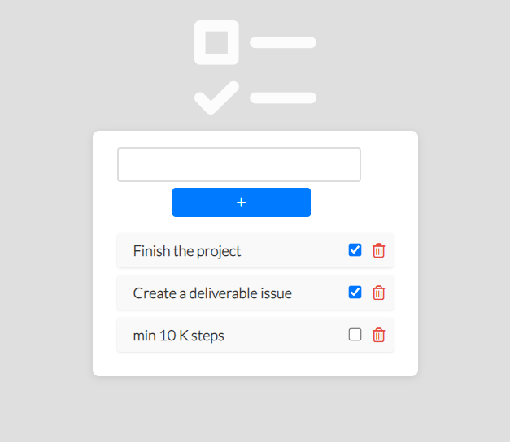

# Table of contents

- [Table of contents](#table-of-contents)
  - [General info](#general-info)
  - [Screenshots](#screenshots)
  - [Technologies](#technologies)
  - [Setup](#setup)
  - [Code Examples](#code-examples)
  - [Features](#features)
  - [Status](#status)
  - [Inspiration](#inspiration)
  - [Contact](#contact)

## General info

> The objective of the project is to practice separation of concern in
> JavaScript.

## Screenshots



## Technologies

- JavaScript
- HTML5
- CSS3
- VSC code

## Setup

clone the repo and start using the To-Do list.

## Code Examples

```js
export const addHandler = async () => {
    const value = dom.input.value;
    if (!value) {
        return;
    }

    const todoData = {
        title: value,
        completed: false,
    };
    await addToDo(todoData);
};

```

## Features

List of features ready and Todos for future development

-
-
-

To-do list:

-
-

## Status

Project is: _finished_

## Inspiration

## Contact

- [Emrah](https://github.com/emrahhko)
